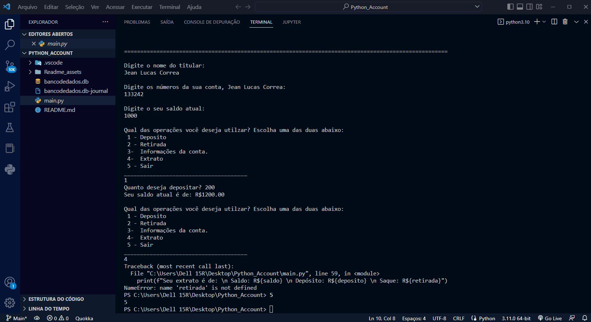
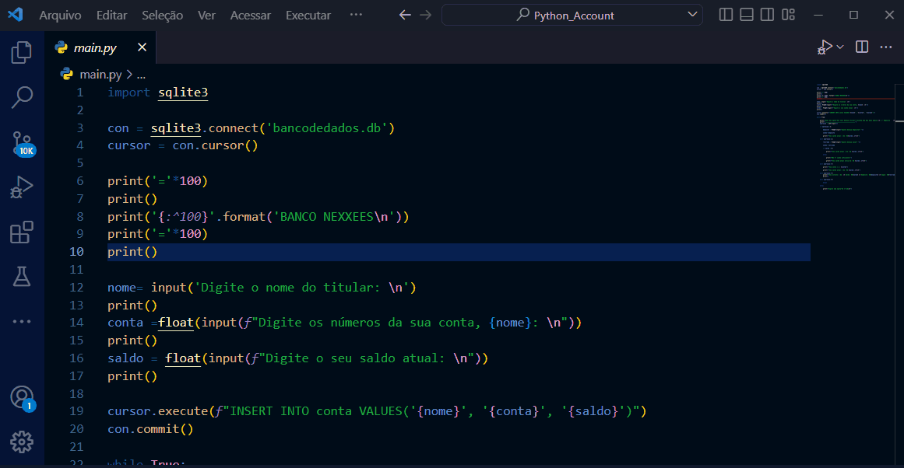

# 💲 BANCO NEXXEES 💲

---

 Esse Projeto faz parte do processo seletivo para o Grupo Nexxees. A aplicação é uma conta bancária e nela poderão ser feitos saques, depositos e extrato. 

---
Nota: Olá entrevistadores, este é o meu projeto! Foi meu primeiro contato com Python, e a primeira vez que integrei um banco de dados em uma aplicação. Tive dificuldades ao criar o extrato e de criar a api rest, optando asssim por criar um banco de dados.
---
 

📌 
    <a href="#">PRÉ-REQUISITOS</a>
    <a href="#">FUNÇÕES</a>
    <a href="#">PROJETO</a>
    <a href="#">TECNOLOGIAS</a>
    <a href="#">AUTOR</a>📌 

 

---

### 📋  PRÉ REQUISITOS: 
   
Para rodar esse projeto na sua máquina você precisará do Python instalado. Para ter acesso ao banco de dados, precisará ter o DB Browser(SQLite) instalado.
 

Rodar o terminal da IDE, usar a aplicação, em seguida utilizar os seguintes passos para visualizar banco de dados:
 

---
### PROJETO:

---

### 🛠️ Ferramentas e Tecnologias:

As Ferramentas a seguir foram utilizadas na contrução do projeto:

- Python
- SQLite

---

✒️ Feito por: <a href="https://github.com/Jeanlcorrea">Jean Correa</a>. 
